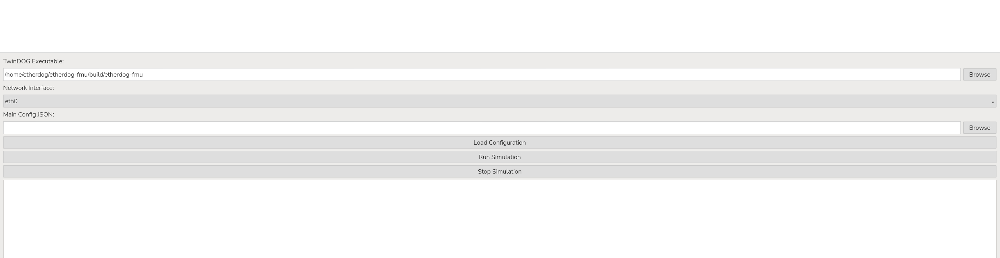

# EtherDOG

**EtherDOG** (**EtherCAT Dynamic Object Generator**) is a software-defined EtherCAT device simulation platform. It allows users to create and run virtual EtherCAT slave devices whose behaviour is controlled by FMU models.

The main goal of EtherDOG is to make EtherCAT device testing more flexible. Instead of always needing physical EtherCAT terminals, users can simulate a virtual EtherCAT network, connect it to an EtherCAT master, and exchange process data with FMU-based simulation models.

In EtherDOG:

* **KickCAT** is used to emulate the EtherCAT slave stack.
* **FMU models** are used to represent the behaviour of the virtual machine, plant, sensor, actuator, or system.
* **JSON configuration files** define which FMU variables are connected to which EtherCAT PDO entries.

This makes EtherDOG useful for rapid testing, validation, controller development, education, and demonstrations without requiring all physical EtherCAT hardware to be available.

---

## 1. What is KickCAT?

[KickCAT](https://github.com/leducp/KickCAT) is an open-source C++ EtherCAT stack. It provides EtherCAT master and slave functionality and includes features such as:

* EtherCAT state machine support: `INIT -> PRE-OP -> SAFE-OP -> OP`
* Process data exchange using PDOs
* CoE / CANopen over EtherCAT support
* SDO read/write support
* ESI XML parsing
* EtherCAT Slave Controller emulation
* Network simulation support
* Raw Ethernet frame handling

KickCAT is designed to be embedded inside other C++ applications. This is exactly how EtherDOG uses it.

EtherDOG does **not** re-implement EtherCAT from scratch. Instead, EtherDOG uses KickCAT as the EtherCAT communication layer and then adds FMU integration and dynamic PDO-to-FMU mapping on top.

---

## 2. How EtherDOG uses KickCAT

EtherDOG uses KickCAT as a C++ library.

In the CMake project, EtherDOG links against:

```cmake
KickCAT::kickcat
fmi4cpp::fmi4cpp
```

KickCAT is responsible for the EtherCAT side of the simulation:

1. EtherDOG loads an EEPROM BIN file for each virtual slave.
2. KickCAT creates an emulated EtherCAT Slave Controller from that EEPROM data.
3. EtherDOG loads the matching ESI XML file.
4. KickCAT parses the ESI XML and builds the CoE object dictionary.
5. KickCAT enables the CoE mailbox for SDO access.
6. KickCAT processes EtherCAT frames from the master.
7. KickCAT handles the slave state machine and EtherCAT datagrams.
8. EtherDOG connects KickCAT PDO memory to FMU variables.

The FMU side is handled by `fmi4cpp`. EtherDOG loads the FMU, reads and writes FMU variables, and steps the FMU simulation in parallel with EtherCAT frame processing.

The basic runtime architecture is:

```text
EtherCAT Master
      |
      | Raw Ethernet frames
      v
KickCAT inside EtherDOG
      |
      | Emulated ESC + PDO + CoE + SDO
      v
EtherDOG Mapping Layer
      |
      | PDO <-> FMU variable conversion
      v
FMU Simulation Model
```

---

## 3. Requirements

This project is intended to run on Linux.

Tested/developed environment:

```text
OS: Linux / Ubuntu / Raspberry Pi OS
Compiler: GCC with C++17 support
Build system: CMake
EtherCAT interface: Ethernet interface with raw socket access
```

Required software:

* `git`
* `cmake`
* `g++`
* `make`
* `python3`
* `pip`
* `conan`
* `fmi4cpp`
* `KickCAT`
* `spdlog`
* `nlohmann_json`
* `tinyxml2`

Install common system packages:

```bash
sudo apt update

sudo apt install -y \
    git \
    build-essential \
    cmake \
    python3 \
    python3-pip \
    python3-venv \
    pkg-config \
    libspdlog-dev \
    nlohmann-json3-dev \
    libtinyxml2-dev \
    libzip-dev \
    libpugixml-dev
```

---

## 4. Install KickCAT

EtherDOG uses KickCAT as a library, so KickCAT must be built and installed before building EtherDOG.

Clone KickCAT:

```bash
cd ~
git clone https://github.com/leducp/KickCAT.git
cd KickCAT
```

Configure KickCAT:

```bash
./scripts/configure.sh build --with=simulation --with=tools --with=esi_parser -ni
```

Set up the KickCAT build environment:

```bash
./scripts/setup_build.sh build
```

Build KickCAT:

```bash
cmake --build build -j$(nproc)
```

Install KickCAT:

```bash
sudo cmake --install build
```

After installation, EtherDOG should be able to find KickCAT using:

```cmake
find_package(KickCAT CONFIG REQUIRED)
```

If CMake cannot find KickCAT later, add `/usr/local` to `CMAKE_PREFIX_PATH` when configuring EtherDOG:

```bash
cmake -S . -B build -DCMAKE_PREFIX_PATH=/usr/local
```

---

## 5. Install FMI4cpp

EtherDOG uses `fmi4cpp` to load and run FMU models.

Clone and build FMI4cpp:

```bash
cd ~
git clone https://github.com/NTNU-IHB/FMI4cpp.git
cd FMI4cpp
```

Configure:

```bash
cmake -S . -B build \
    -DCMAKE_BUILD_TYPE=Release \
    -DFMI4CPP_BUILD_EXAMPLES=OFF \
    -DFMI4CPP_BUILD_TESTS=OFF
```

Build:

```bash
cmake --build build -j$(nproc)
```

Install:

```bash
sudo cmake --install build
sudo ldconfig
```

After installation, EtherDOG should be able to find FMI4cpp using:

```cmake
find_package(fmi4cpp REQUIRED)
```

---

## 6. Clone and build EtherDOG

Clone this repository:

```bash
cd ~
git clone https://github.com/phamnhatha090805/EtherDOG.git
cd EtherDOG
```

Create a build folder:

```bash
mkdir -p build
cd build
```

Configure the project:

```bash
cmake ..
```

If CMake cannot find KickCAT or FMI4cpp, use:

```bash
cmake .. -DCMAKE_PREFIX_PATH="/usr/local"
```

Build EtherDOG:

```bash
cmake --build . -j$(nproc)
```

After a successful build, the executable should be available as:

```bash
./etherdog-fmu
```

---

## 7. Why FMPy is needed

EtherDOG uses an FMU model to simulate the behaviour of the virtual EtherCAT device, machine, plant, sensor, actuator, or system. During runtime, EtherDOG loads the FMU through `fmi4cpp`, connects FMU variables to EtherCAT PDO entries, and steps the FMU simulation while EtherCAT frames are being processed.

This means EtherDOG does not only need a valid `.fmu` file. It needs an FMU that can actually run on the same machine where EtherDOG is running.

This is important because an FMU is not always fully platform-independent. An `.fmu` file is a ZIP package. It can contain:

* `modelDescription.xml`
* platform-specific compiled binaries
* C source files
* resources
* documentation

If the FMU contains a compiled binary, that binary is specific to an operating system and computer architecture.

For example:

| Target machine        | Typical architecture | FMU binary needed                      |
| --------------------- | -------------------: | -------------------------------------- |
| Windows PC            |               x86_64 | Windows binary, for example `.dll`     |
| WSL Ubuntu / Linux PC |               x86_64 | Linux x86_64 binary, for example `.so` |
| Raspberry Pi 64-bit   |      aarch64 / ARM64 | Linux ARM64 binary, for example `.so`  |
| Raspberry Pi 32-bit   |         armv7l / ARM | Linux ARM binary, for example `.so`    |

A common problem is exporting an FMU from Simulink on a PC and then copying it directly to a Raspberry Pi. The FMU may contain source files or a binary for another platform, but not a binary that the Raspberry Pi can load. In that case, EtherDOG cannot run the FMU even if the JSON mapping, ESI file, EEPROM file, and EtherCAT setup are correct.

FMPy is used before running EtherDOG to check and re-built the FMU if needed.

In short:

```text
EtherDOG runs the FMU.
FMPy checks and prepares the FMU before EtherDOG runs it.
```

Use this workflow below whenever you create a new FMU or move an FMU to another machine, especially when moving between a PC, WSL Ubuntu, and Raspberry Pi.

### 7.1 Install FMPy

Create and activate a Python virtual environment:

```bash
cd ~
python3 -m venv venv
source ~/venv/bin/activate
```

Install FMPy:

```bash
python -m pip install --upgrade pip setuptools wheel
python -m pip install "fmpy[complete]"
```

Open the FMPy GUI:

```bash
python -m fmpy.gui
```

### 7.2 Extra Ubuntu / WSL GUI dependencies

On Ubuntu or WSL, the FMPy GUI may need extra Qt/WebEngine system libraries.

Install them with:

```bash
sudo apt update
sudo apt install -y \
    libnspr4 \
    libnss3 \
    libasound2t64 \
    libxss1 \
    libxtst6 \
    libxcomposite1 \
    libxdamage1 \
    libxrandr2 \
    libgbm1 \
    libdbus-1-3 \
    libatk1.0-0 \
    libatk-bridge2.0-0 \
    libcups2 \
    libdrm2 \
    libxkbcommon0 \
    libxkbcommon-x11-0 \
    libxcb-cursor0 \
    libxcb-xinerama0 \
    libxcb-icccm4 \
    libxcb-image0 \
    libxcb-keysyms1 \
    libxcb-render-util0 \
    libxcb-randr0 \
    libxcb-shape0 \
    libxcb-sync1 \
    libxcb-xfixes0 \
    libgl1 \
    libegl1 \
    libglib2.0-0
```

### 7.3 Rebuild or re-export the FMU if needed

Use this rule:

```text
If the FMU already contains a binary for the target machine:
    You can use it directly with EtherDOG.

If the FMU contains source code but no correct binary:
    Compile or rebuild the FMU for the target machine.

If the FMU does not contain a binary for the target machine:
    Re-export the FMU from the original modelling tool for the correct platform.
```

For example, if EtherDOG runs on Raspberry Pi 64-bit and the FMU only contains `binaries/win64` or `binaries/linux64`, the FMU will not run correctly on the Pi. The FMU must be rebuilt or re-exported for Linux ARM64 / `aarch64`.

### 7.4 Recommended EtherDOG workflow with FMU

The recommended workflow is:

```text
1. Create or export the FMU from Simulink, Modelica, or another modelling tool.

2. Copy the FMU to the machine where EtherDOG will run.

3. Check the target machine architecture:
       uname -m

4. Inspect the FMU contents:
       unzip -l model.fmu | grep -E "binaries|\.so|\.dll|sources"

5. Open the FMU in FMPy:
       source ~/venv/bin/activate
       python -m fmpy.gui

6. Validate, simulate, compile, rebuild, or re-export the FMU if needed.

7. Update the EtherDOG JSON configuration so `fmuPath` points to the prepared FMU.

8. Build and run EtherDOG.
```

Example JSON field:

```json
{
  "fmuPath": "../Examples/FmuModel/DemoModel-1.fmu"
}
```

Only run EtherDOG after the FMU has been checked on the target machine.

### 7.5 Network note for installing FMPy

FMPy is installed from PyPI. Some company or school networks may block or reset Python package downloads.

If the installation fails with an error like:

```text
Connection reset by peer
files.pythonhosted.org
```

try another network, then run the install command again:

```bash
python -m pip install "fmpy[complete]"
```

---

## 8. Run the first example

From the build directory:

```bash
cd ~/etherdog-fmu/build
sudo ./etherdog-fmu -f ../Examples/SimConfigDemo.json
```

Expected startup behaviour:

1. EtherDOG starts.
2. The JSON configuration file is loaded.
3. The FMU path is read from the config file.
4. The virtual slaves are created.
5. Each EEPROM BIN file is loaded.
6. Each matching ESI XML file is loaded.
7. KickCAT creates the CoE object dictionary.
8. The FMU is loaded through FMI4cpp.
9. PDO-to-FMU mappings are resolved.
10. EtherDOG starts the simulation loop.

Example output may include messages such as:

```text
EtherDOG FMU simulation starting...
EEPROM info for slave 0
Found matching device in ESI XML
Loading FMU from path: ...
Load configuration successfully. Simulation has not started yet.
Starting simulation...
```

To stop the simulation, press:

```text
Ctrl + C
```

EtherDOG should stop gracefully.

---

## 9. Using the GUI

EtherDOG also includes a simple Python GUI called `TwinDOG.py`.

The GUI provides a more user-friendly way to select the EtherDOG executable, choose the network interface, load a simulation configuration file, start the simulation, stop the simulation, and view the runtime log output.

The GUI does not replace the JSON configuration file.
It uses the same JSON configuration files as the command-line version.

### 9.1 Install GUI dependencies

The GUI is written with PyQt5. Install PyQt5 before running the GUI:

```bash
sudo apt install -y python3-pyqt5
```

Alternatively, PyQt5 can be installed with pip:

```bash
python3 -m pip install PyQt5
```

### 9.2 Start the GUI

From the EtherDOG project folder, run:

```bash
cd ~/EtherDOG
python3 TwinDOG.py
```

If EtherDOG needs administrator permission to access the Ethernet interface, run the GUI with `sudo`:

```bash
cd ~/etherdog-fmu
sudo -E python3 TwinDOG.py
```

The `-E` option keeps the user environment, which can help when Python or PyQt5 is installed in the user environment.

### 9.3 GUI fields

When the GUI opens, it shows several fields.

| GUI field            | Description                                                   |
| -------------------- | ------------------------------------------------------------- |
| `TwinDOG Executable` | Path to the compiled `etherdog-fmu` executable                |
| `Network Interface`  | Ethernet interface used for EtherCAT communication            |
| `Main Config JSON`   | JSON simulation configuration file                            |
| `Run Simulation`     | Starts EtherDOG using the selected executable and config file |
| `Stop Simulation`    | Stops the running simulation                                  |
| Output window        | Shows the EtherDOG runtime log output                         |


---

## 10. JSON configuration format

EtherDOG uses a JSON file to define the virtual EtherCAT network.

Example:

```json
{
  "interface": "eth0",
  "fmuPath": "../Examples/FmuModel/DemoModel-1.fmu",
  "slaves": [
    {
      "eeprom": "../Examples/EsiFiles/BIN/Box 1 (EtherDOG).bin",
      "coe_xml": "../Examples/EsiFiles/XML/EtherDOG.xml",
      "input-mappings": {
        "RoomTemperature": "AnalogIN0",
        "OutdoorSensor": "AnalogIN1"
      },
      "output-mappings": {
        "HeaterGain": "AnalogOUT0"
      }
    }
  ]
}
```

### Top-level fields

| Field       | Description                                              |
| ----------- | -------------------------------------------------------- |
| `interface` | Linux network interface used for EtherCAT frame exchange |
| `fmuPath`   | Path to the FMU model                                    |
| `slaves`    | Array of virtual EtherCAT slaves                         |

### Slave fields

| Field             | Description                                      |
| ----------------- | ------------------------------------------------ |
| `eeprom`          | Path to the EEPROM BIN file of the virtual slave |
| `coe_xml`         | Path to the ESI XML file of the virtual slave    |
| `input-mappings`  | Maps FMU variables to EtherCAT input PDOs        |
| `output-mappings` | Maps EtherCAT output PDOs to FMU variables       |

---

## 11. PDO naming rules

PDO names in the JSON file must match entries from the CoE object dictionary loaded from the ESI XML file.

For simple devices, the PDO name may be a direct entry name:

```json
"Out1": "AnalogIN0"
```

For Beckhoff terminals with repeated channel names, use the format:

```text
Channel name/Entry name
```

Example:

```json
"Power": "AO outputs Ch.1/Analog output"
```

This tells EtherDOG to look for:

```text
Object name: AO outputs Ch.1
Entry description: Analog output
```

This is useful for terminals such as EL4004, where multiple channels may have entries with the same description.

---

## 12. Add multiple virtual slaves

The `slaves` field is an array, so you can add multiple virtual devices.

Example:

```json
{
  "interface": "eth0",
  "fmuPath": "../Examples/FmuModel/DemoModel-1.fmu",
  "slaves": [
    {
      "eeprom": "../Examples/EsiFiles/BIN/Box 1 (EtherDOG).bin",
      "coe_xml": "../Examples/EsiFiles/XML/EtherDOG.xml",
      "input-mappings": {
        "RoomTemperature": "AnalogIN0"
      }
    },
    {
      "eeprom": "../Examples/EsiFiles/BIN/Official Beckhoff/Term 1 (EK1100).bin",
      "coe_xml": "../Examples/EsiFiles/XML/Official Beckhoff/Beckhoff EK11xx.xml"
    },
    {
      "eeprom": "../Examples/EsiFiles/BIN/Official Beckhoff/Term 2 (EL4004).bin",
      "coe_xml": "../Examples/EsiFiles/XML/Official Beckhoff/Beckhoff EL4xxx.xml",
      "output-mappings": {
        "Power": "AO outputs Ch.1/Analog output"
      }
    }
  ]
}
```

The order in the JSON file is the virtual EtherCAT slave order.

---

## 13. Runtime behaviour

EtherDOG runs two main runtime activities:

### EtherCAT frame processing

This receives EtherCAT frames from the master, passes the datagrams through each emulated slave, updates the KickCAT slave state machine, and sends the response frame back to the master.

### FMU simulation stepping

This executes the FMU model repeatedly using a fixed step size. During each FMU step:

1. EtherDOG reads EtherCAT output PDO values.
2. These values are written into mapped FMU input variables.
3. The FMU simulation advances by one step.
4. EtherDOG reads mapped FMU output variables.
5. These values are written into EtherCAT input PDO memory.

This creates a continuous data exchange loop between the EtherCAT master and the FMU model.

---

## 14. Troubleshooting

### CMake cannot find KickCAT

Error example:

```text
Could not find a package configuration file provided by "KickCAT"
```

Fix:

```bash
sudo cmake --install ~/KickCAT/build
sudo ldconfig
```

Then configure EtherDOG again:

```bash
cd ~/EtherDOG
rm -rf build
mkdir build
cd build
cmake .. -DCMAKE_PREFIX_PATH="/usr/local"
```

### CMake cannot find fmi4cpp

Error example:

```text
Could not find a package configuration file provided by "fmi4cpp"
```

Fix:

```bash
sudo cmake --install ~/FMI4cpp/build
sudo ldconfig
```

Then configure EtherDOG again:

```bash
cmake .. -DCMAKE_PREFIX_PATH="/usr/local"
```

### Permission denied when opening the network interface

EtherDOG needs raw socket access.

Run with `sudo`:

```bash
sudo ./etherdog-fmu -f ../Examples/SimConfigDemo.json
```

### Wrong network interface

Check your available interfaces:

```bash
ip link show
```

Then update the JSON config:

```json
"interface": "your_interface_name"
```

### TwinCAT cannot find the virtual slaves

Check the following:

1. EtherDOG is already running before scanning in TwinCAT.
2. The correct network interface is selected in the JSON file.
3. The Ethernet cable is connected to the correct port.
4. The interface is not blocked by NetworkManager or another service.
5. You are running EtherDOG with `sudo`.
6. The ESI XML and EEPROM BIN file match.
7. TwinCAT is scanning the correct Ethernet adapter.

### ESI XML does not match EEPROM

EtherDOG checks that the ESI XML matches the EEPROM identity information.

If vendor ID, product code, or revision number do not match, EtherDOG will stop with an error.

Make sure the `eeprom` and `coe_xml` fields in the JSON file belong to the same device.

### PDO entry not found

Error example:

```text
PDO entry not found
```

This means the PDO name in the JSON file does not match the CoE dictionary entry from the ESI XML.

Fix:

1. Check the exact PDO entry name in the ESI XML.
2. Use `Channel/Entry` format if the same entry name exists in multiple channels.
3. Make sure spelling and capitalization match.
4. Make sure the selected ESI XML belongs to the selected device.

### CoE entry is not mapped

Warning example:

```text
Warning: CoE entry for PDO '...' is not mapped. Skipping mapping for this entry.
```

This means the PDO entry exists in the object dictionary, but it is not currently part of the active PDO assignment.

Fix:

1. Check the PDO assignment in the ESI XML.
2. Check whether the EtherCAT master enables that PDO in its configuration.
3. In TwinCAT, check the process data tab of the slave.
4. Make sure the mapping in JSON points to an actually mapped PDO entry.

---

## 15. Current limitations

EtherDOG is still a development/research platform. Current limitations may include:

* Not all EtherCAT device behaviours are fully simulated.
* Correct operation depends on the quality of the ESI XML and EEPROM BIN files.
* PDO mapping must match the active PDO assignment.
* Real-time performance depends on the host system and network interface.
* The FMU step size is currently fixed in the code.
* Advanced EtherCAT features may require additional implementation.

---

## 16. Basic workflow summary

```text
1. Install dependencies
2. Build and install KickCAT
3. Build and install FMI4cpp
4. Check the FMU files using FMPy
5. Build EtherDOG
6. Select the correct network interface
7. Choose or create a JSON simulation config
8. Start EtherDOG with sudo
9. Scan the virtual EtherCAT network from TwinCAT or another master
10. Move the network to OP state
11. Exchange PDO data between the PLC and the FMU model
```

Quick command summary:

```bash
cd ~/EtherDOG
mkdir -p build
cd build
cmake ..
cmake --build . -j$(nproc)
sudo ./etherdog-fmu -f ../Examples/SimConfigDemo.json
```

---

## 17. License and acknowledgements

EtherDOG builds on top of several open-source projects:

* [KickCAT](https://github.com/leducp/KickCAT) for the EtherCAT stack, slave emulation, CoE support, ESI parsing, and EtherCAT frame handling.
* [FMI4cpp](https://github.com/NTNU-IHB/FMI4cpp) for loading and running FMU simulation models.
* [FMPy](https://github.com/CATIA-Systems/FMPy) for loading, checking, or re-export FMU files.
* [spdlog](https://github.com/gabime/spdlog) for logging.

Special thanks to the developers and maintainers of KickCAT, FMI4cpp, and FMPy.  
Their work made it possible for EtherDOG to focus on dynamic virtual EtherCAT device generation, PDO/FMU mapping, and simulation workflow development instead of re-implementing the complete EtherCAT and FMI foundations from scratch.

Please check the licenses of these projects before using EtherDOG in a commercial or redistributed system.